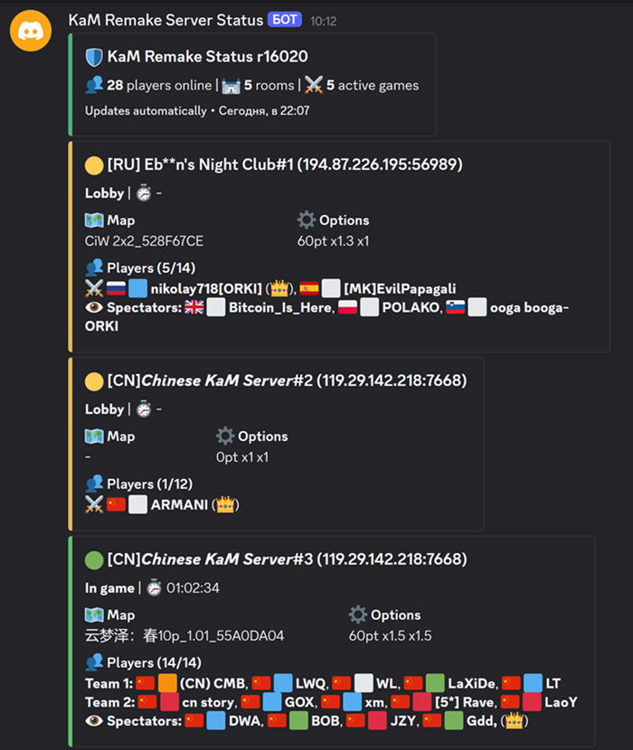

# KaM Discord Status Bot

Discord bot that polls `server-poller-json-linux-amd64` and keeps one text-only status embed updated in a configured channel.

## Preview



## Setup

1. Create a Discord application and bot token in the Discord Developer Portal.
2. Invite the bot to your server with permissions to view the status channel, send messages, embed links, and read message history.
3. Copy `.env.example` to `.env` and fill in:

```env
DISCORD_TOKEN=your-token
DISCORD_CHANNEL_ID=your-channel-id
```
## How to get DISCORD_CHANNEL_ID

Turn on Developer Mode in Discord:
User Settings -> Advanced -> Developer Mode.

Right click on the desired channel Status -> Copy Channel ID

## Run with Docker

```bash
docker compose up -d --build
```

The bot stores the Discord message id in `./data/status-message.json`, so after restarts it edits the same message instead of posting a new one.

## Configuration

Optional environment variables:

```env
GAME_REVISION=r16020
MASTER_URL=http://master.kamremake.com/
INCLUDE_EMPTY_ROOMS=false
POLLER_TIMEOUT=6s
MASTER_TIMEOUT=2s
SERVER_CACHE=/app/data/servers-cache.json
UPDATE_INTERVAL=60
ERROR_RETRY_INTERVAL=30
BOT_ACTIVITY=KaM server status
SHOW_PLAYER_FLAGS=true
SHOW_PLAYER_COLORS=false
```

If the poller exits with an error or returns invalid JSON, the bot updates the message with an error state and retries after `ERROR_RETRY_INTERVAL` seconds.
If the poller returns valid JSON with `fromcache: true`, the bot keeps showing the room data and adds a warning that the server list came from cache. The `KaM Remake Status` header also shows cached servers from `SERVER_CACHE` as `Name IP:port`. If the JSON contains a non-empty `error` field, that error is shown in the header embed.

The status message uses one header embed plus separate room embeds. Lobby rooms are sorted first and highlighted with a green embed accent; in-game rooms use a yellow accent. Each room shows server name with a display number, IP:port, game status, game time, optional description, lock icon, peacetime/speeds, map, teams, optional flags, optional player color markers, host marker, bot marker, and spectators. Bot players are shown as `AI` or `AdvAI`; closed slots are shown separately and count toward room occupancy, but not players online.
